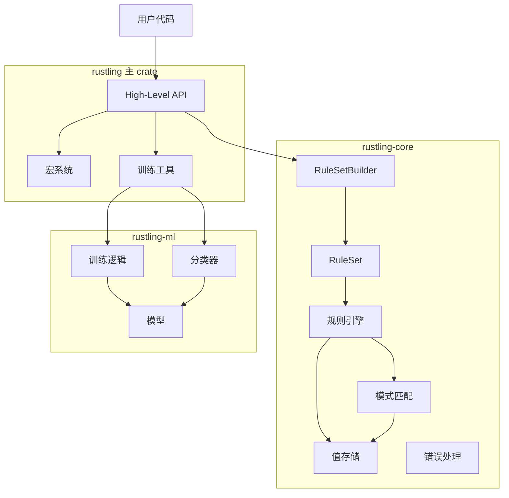
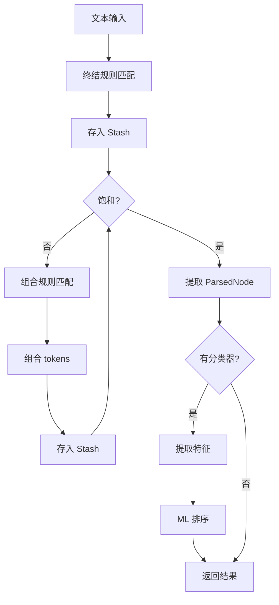

# Rustling 架构设计文档

**版本**: 2.0
**创建日期**: 2026-02-12
**最后更新**: 2026-02-27
**作者**: Claude Code

> v1.0 记录 Phase 0 初始架构（三层）；v2.0 反映当前完整实现（双模式五层架构）。

---

## 目录

1. [概述](#概述)
2. [当前架构总览](#当前架构总览)
3. [架构原则](#架构原则)
4. [模块结构](#模块结构)
5. [核心组件](#核心组件)
6. [新增组件（Phase 1–6B）](#新增组件)
7. [数据流](#数据流)
8. [类型系统](#类型系统)
9. [扩展机制](#扩展机制)
10. [性能参考](#性能参考)

---

## 概述

Rustling 是 Duckling（Haskell 自然语言解析库）的 Rust 移植版本，在原始三层架构之上扩展为**双模式五层架构**，同时支持在线（HTTP/gRPC）和离线（FFI/Android）两种部署场景。

### 设计目标

- **类型安全**: 利用 Rust 的强类型系统防止运行时错误
- **高性能**: 零成本抽象，FFI 层延迟 <10µs
- **跨平台**: 同一 codebase 编译为服务端二进制 + Android .so 库
- **可扩展**: 动态规则 JSON 配置 + Apollo 热重载，无需重新编译
- **多语种**: 28 种语言统一 LocaleRegistry，启动时全量加载

### 核心能力

- 模式匹配（正则表达式、过滤器）
- 规则组合（最多 6 个输入）
- 饱和解析（exhaustive parsing）
- ML 排序（可选朴素贝叶斯）
- SmartMatcher 三层模糊匹配（规范化 → Levenshtein → fastText）
- 动态规则引擎（exact/regex Terminal + template 基础）
- 多语种路由（LocaleRegistry，28 语言）
- 双模式服务：HTTP REST + gRPC（在线）/ C FFI（离线/Android）

---

## 当前架构总览

```
输入文本
    │
    ▼
┌────────────────────────────────────────────┐
│  Layer 1: SmartMatcher（模糊预处理）        │
│  PatternNormalizer → LevenshteinMatcher     │
│  → FastTextExpander（可选 feature）         │
└────────────────────────────────────────────┘
    │ 规范化文本
    ▼
┌────────────────────────────────────────────┐
│  Layer 2: LocaleRegistry（多语种路由）      │
│  28 语言规则集，启动时全量构建              │
│  locale → RuleSet 查找                     │
└────────────────────────────────────────────┘
    │ 对应语言 RuleSet
    ▼
┌────────────────────────────────────────────┐
│  Layer 3: 解析引擎（rustling-core）         │
│  终结规则 → Stash → 组合规则 → 饱和        │
│  + 动态规则引擎（JSON/Apollo 热重载）       │
└────────────────────────────────────────────┘
    │ ParsedNode[]
    ▼
┌────────────────────────────────────────────┐
│  Layer 4: ML 排序（rustling-ml，可选）      │
│  朴素贝叶斯 → ParserMatch 排序             │
└────────────────────────────────────────────┘
    │ 结构化结果
    ▼
┌──────────────┬──────────────┬──────────────┐
│ Layer 5a     │ Layer 5b     │ Layer 5c     │
│ HTTP Server  │ gRPC Server  │ C FFI 库     │
│ (Actix-web)  │ (tonic)      │ (Android JNI)│
│ REST API     │ Protobuf RPC │ .so 离线解析 │
└──────────────┴──────────────┴──────────────┘
```

---

## 架构原则

### 1. 分层架构（初始三层，现已扩展为五层）

```
┌─────────────────────────────────┐
│   High-Level API (rustling)    │  ← 用户接口层
├─────────────────────────────────┤
│   ML Module (rustling-ml)      │  ← 机器学习层
├─────────────────────────────────┤
│   Core Engine (rustling-core)  │  ← 解析引擎核心
└─────────────────────────────────┘
```

### 2. 依赖方向

- **核心无依赖**: `rustling-core` 不依赖 ML 模块
- **单向依赖**: 上层可依赖下层，反之则不行
- **可插拔**: ML 模块是可选的

### 3. 零成本抽象

- 泛型在编译时单态化
- 内联小函数
- 零运行时反射

---

## 模块结构

### 整体架构图



### 模块职责

#### `rustling-core` (核心引擎)

| 文件 | 职责 | 关键类型 |
|------|------|---------|
| `lib.rs` | 公共 API、类型定义 | `RuleSet`, `ParsedNode` |
| `builder.rs` | 规则集构建器 | `RuleSetBuilder` |
| `rule.rs` | 规则定义与执行 | `Rule1..6`, `TerminalRule` |
| `pattern.rs` | 模式匹配 | `TextPattern`, `FilterNodePattern` |
| `stash.rs` | 值存储与索引 | `Stash`, `StashIndexable` |
| `error.rs` | 错误类型 | `RustlingError` |
| `helpers.rs` | 边界检查 | `BoundariesChecker` |
| `range.rs` | 范围类型 | `Range` |

#### `rustling-ml` (机器学习)

| 文件 | 职责 | 关键类型 |
|------|------|---------|
| `lib.rs` | ML 公共 API | `Classifier`, `Model` |

#### `rustling` (高层 API)

| 文件 | 职责 | 关键类型 |
|------|------|---------|
| `lib.rs` | 重新导出、高层封装 | `Parser`, `ParserMatch` |
| `macros.rs` | 辅助宏 | `build_rules!`, `dim!` |
| `train.rs` | 训练工具 | `Example`, `Check` |

---

## 核心组件

### 1. 解析引擎 (Core Engine)

#### RuleSetBuilder

**作用**: 构建规则集的流畅 API

```rust
let builder = RuleSetBuilder::new(
    BoundariesChecker::detailed(),
    BoundariesChecker::separated_alphanumeric_word(),
);

// 终结规则：匹配文本
builder.rule_1("integer",
    builder.reg(r"\d+").unwrap(),
    |text| Ok(Int(text.parse()?))
);

// 组合规则：组合两个值
builder.rule_2("add",
    dim!(Int),
    dim!(Int),
    |a, b| Ok(Int(a.value() + b.value()))
);

let rule_set = builder.build();
```

**设计模式**: Builder + 类型状态机

#### RuleSet

**作用**: 执行规则应用的核心引擎

```rust
pub struct RuleSet<S> {
    composition_rules: Vec<Box<dyn Rule<S>>>,
    terminal_rules: Vec<Box<dyn TerminalRule<S>>>,
    // ...
}
```

**关键方法**:
- `apply_all(text: &str)`: 饱和解析，返回所有匹配

**算法**:
1. 应用终结规则生成初始 tokens
2. 迭代应用组合规则直到饱和
3. 返回所有匹配的 `ParsedNode`

#### Pattern Trait

**作用**: 定义匹配逻辑的抽象

```rust
pub trait Pattern<StashValue> {
    type M;
    fn accepts(&self, node: &Node<StashValue>) -> bool;
    fn produce(&self, nodes: &[Node<StashValue>])
        -> Vec<Match<Self::M>>;
}
```

**实现类型**:
- `TextPattern`: 正则表达式匹配
- `FilterNodePattern`: 值过滤器
- `AnyNodePattern`: 匹配任意节点

#### Stash

**作用**: 高效存储和索引解析值

```rust
pub struct Stash<S: StashIndexable> {
    arenas: FnvHashMap<S::Index, Vec<S>>,
}
```

**优化**: 按类型索引，避免遍历所有值

---

### 2. ML 模块 (ML Module)

#### Classifier

**作用**: 对解析结果进行排序/分类

```rust
pub struct Classifier<Id, Class, Feat> {
    models: FnvHashMap<Id, Model<Class, Feat>>,
}
```

**工作流程**:
1. 提取特征 (`Feature`)
2. 使用朴素贝叶斯模型预测
3. 返回最可能的类别

#### Model

**作用**: 存储训练好的朴素贝叶斯模型

```rust
pub struct Model<Class, Feat> {
    classes: Vec<Class>,
    // P(class)
    prior: FnvHashMap<Class, f32>,
    // P(feature|class)
    likelihood: FnvHashMap<(Feat, Class), f32>,
}
```

---

### 3. 高层 API (High-Level API)

#### Parser

**作用**: 面向用户的便捷接口

```rust
pub struct Parser<V> {
    rule_set: RuleSet<V>,
    classifier: Option<Classifier<...>>,
}

impl<V> Parser<V> {
    pub fn parse(&self, text: &str) -> Vec<ParserMatch<V>>;
}
```

**特性**:
- 自动 ML 排序（如果提供分类器）
- 转换为用户友好的 `ParserMatch`

#### 辅助宏

**`dim!` 宏**: 简化值过滤器创建

```rust
// 匹配所有 Int 值
dim!(Int)

// 匹配满足条件的 Int 值
dim!(Int, vec![Box::new(|a: &Int| a.0 > 0)])
```

**`build_rules!` 宏**: 生成枚举和转换（可选）

---

## 数据流

### 解析流程



### 详细步骤

#### 1. 初始化

```rust
let text = "I have 12 thousands";
let stash = Stash::new();
```

#### 2. 终结规则应用

```
文本: "I have 12 thousands"

规则: r"\d+" → Int(12)
规则: "thousands?" → Int(1000)

Stash: [Int(12), Int(1000)]
```

#### 3. 组合规则应用（第 1 轮）

```
模式: Int (>1, <99) + Int (==1000)
生产: Int(12 * 1000) = Int(12000)

Stash: [Int(12), Int(1000), Int(12000)]
```

#### 4. 饱和检测

```
第 2 轮: 无新值生成 → 饱和
```

#### 5. 结果返回

```rust
vec![
    ParserMatch { value: Int(12), byte_range: 7..9, ... },
    ParserMatch { value: Int(1000), byte_range: 10..19, ... },
    ParserMatch { value: Int(12000), byte_range: 7..19, ... },
]
```

---

## 类型系统

### 核心 Trait

#### NodePayload

**作用**: 定义可解析的值类型

```rust
pub trait NodePayload: Clone {
    type Payload: Clone + PartialEq + Debug;
    fn extract_payload(&self) -> Option<Self::Payload>;
}
```

**示例**:
```rust
impl NodePayload for Int {
    type Payload = MyPayload;
    fn extract_payload(&self) -> Option<MyPayload> {
        Some(MyPayload)
    }
}
```

#### StashIndexable

**作用**: 允许值按类型索引

```rust
pub trait StashIndexable {
    type Index: Hash + Eq;
    fn index(&self) -> Self::Index;
}
```

**优势**: O(1) 类型查找而非 O(n) 遍历

#### AttemptFrom

**作用**: 可失败的类型转换

```rust
pub trait AttemptFrom<V>: Sized {
    fn attempt_from(v: V) -> Option<Self>;
}
```

**用途**: 从枚举变体提取具体类型

---

### 幽灵类型 (Phantom Types)

#### SendSyncPhantomData

**作用**: 标记类型参数，确保线程安全

```rust
pub struct SendSyncPhantomData<T>(PhantomData<T>);
unsafe impl<T> Send for SendSyncPhantomData<T> {}
unsafe impl<T> Sync for SendSyncPhantomData<T> {}
```

**使用场景**: Rule1..6 和 Pattern 结构体

**安全性**: 已审计，详见 `UNSAFE_CODE_AUDIT.md`

---

## 扩展机制

### 添加新规则

#### 1. 定义值类型

```rust
#[derive(Clone, Debug)]
pub struct Temperature {
    value: f32,
    unit: Unit,
}
```

#### 2. 实现必需 Trait

```rust
impl NodePayload for Temperature { /* ... */ }
impl StashIndexable for Temperature { /* ... */ }
impl InnerStashIndexable for Temperature { /* ... */ }
```

#### 3. 创建规则

```rust
builder.rule_1("celsius",
    builder.reg(r"(-?\d+\.?\d*)\s*°?C").unwrap(),
    |m| Ok(Temperature {
        value: m.group(1).parse()?,
        unit: Unit::Celsius
    })
);
```

### 添加新模式

实现 `Pattern` trait:

```rust
struct CustomPattern;

impl<S> Pattern<S> for CustomPattern {
    type M = MyMatch;

    fn accepts(&self, node: &Node<S>) -> bool {
        // 自定义逻辑
    }

    fn produce(&self, nodes: &[Node<S>])
        -> Vec<Match<Self::M>> {
        // 自定义生产
    }
}
```

---

## 性能参考

### 实测基准（Phase 6-B，2026-02-25）

| 层级 | 操作 | 延迟 |
|------|------|------|
| 核心层 | parse integer | 0.4µs |
| 核心层 | levenshtein distance | 0.4µs |
| 核心层 | pattern normalize | 0.09µs |
| API 层 | parse integer（含 locale 查找） | 6.6µs |
| API 层 | parse duration | 9.6µs |
| API 层 | batch(4 items) | 37.7µs（9.4µs/item） |
| HTTP | 单次解析 | ~25ms |
| Docker | 镜像大小 | **34.3MB** |

完整报告见 [BENCHMARKS.md](../reports/BENCHMARKS.md)。

### 优化策略

#### 1. 零成本抽象

- **泛型单态化**: 编译时展开，无虚拟调用
- **内联**: 小函数自动内联
- **Trait 对象**: 仅在需要动态分发时使用

#### 2. 内存效率

- **SmallVec**: 小数组栈分配
- **String Interning**: 字符串去重
- **Arena 分配**: Stash 按类型分组

#### 3. 算法优化

- **早期退出**: 无匹配时快速返回（~245 ns）
- **索引查找**: O(1) 类型索引
- **正则缓存**: 编译一次，重复使用

### 核心引擎基准（rustling-core，初始测试）

| 操作 | 时间 |
|------|------|
| 简单匹配 | ~900 ns |
| 组合规则 | ~2.4 µs |
| 长文本解析 | ~8.1 µs |

### 内存使用

- **Stash**: O(n) 其中 n = 解析值数量
- **RuleSet**: O(r) 其中 r = 规则数量
- **String Interner**: O(u) 其中 u = 唯一字符串数

---

## 新增组件

> 以下组件为 Phase 1/2/5-A/6-B 中实现，是初始三层架构的扩展。

### 4. SmartMatcher（模糊匹配，Phase 1）

三层流水线，处理输入拼写/缩写容错：

```
输入 → PatternNormalizer → LevenshteinMatcher → FastTextExpander(可选)
       "明早" → "明天早上"   "tomorow" → "tomorrow"  词向量近义扩展
```

- `src/fuzzy/pattern_normalizer.rs` — 15+ 模板，中英文缩写规范化
- `src/fuzzy/levenshtein.rs` — Unicode 编辑距离，阈值 0.85
- `src/fuzzy/smart_matcher.rs` — 三层集成 + Mutex<HashMap> 缓存
- `src/fuzzy/expand.rs` — finalfusion fastText（`--features fasttext`）

### 5. 动态规则引擎（Phase 1）

运行时从 JSON/Apollo 加载规则，无需重新编译：

- `src/dynamic/rules.rs` — DynamicRule 结构体（exact/regex Terminal + template）
- `src/dynamic/engine.rs` — build_ruleset / validate_ruleset / list_rules
- `src/dynamic/loader.rs` — FileLoader / InlineLoader / ApolloLoader（feature-gated）

### 6. LocaleRegistry（多语种路由，2026-02-23）

28 种语言规则集，启动时全量构建，O(1) 查找：

- `src/locale/registry.rs` — `HashMap<&str, RuleSet>` + LangRuleFn 类型别名
- HTTP handler 读取 `locale` 字段，查询 registry，缺失则 warn + 返回空

### 7. HTTP 服务器（Phase 2）

- `src/server/` — Actix-web，6 个 REST 端点 + OpenAPI/Swagger UI
- Apollo 热重载：AtomicU64 版本检测 + Arc<RwLock<>> 原子交换
- X-Request-ID 全链路透传

### 8. gRPC 服务端（Phase 6-B，在线模式）

- `proto/duckling.proto` — Parse / ParseBatch / Health 服务定义
- `src/server/grpc.rs` — tonic 集成，`--features grpc`

### 9. C FFI 库（Phase 6-B，离线模式）

- `src/ffi.rs` — C ABI 接口（`include/rustling.h` 对应头文件）：

  | 函数 | 说明 |
  |------|------|
  | `rustling_parse(text, locale)` | 解析文本，返回 `FfiParseResult`（json/count/error 三字段结构体） |
  | `rustling_free_result(result)` | **推荐**：一次性释放 json 和 error |
  | `rustling_free_string(ptr)` | 释放 version / supported_locales 返回的字符串 |
  | `rustling_free_error(ptr)` | 同 free_string，语义别名 |
  | `rustling_version()` | 返回版本字符串，需用 free_string 释放 |
  | `rustling_supported_locales()` | 返回 JSON 语言列表，需用 free_string 释放 |
  | `rustling_locale_supported(locale)` | 返回 1（支持）或 0 |
  | `rustling_init()` | 预热（可选，减少首次调用延迟） |

- `value` 字段为结构化 JSON 对象（`{"Integer":42}`、`{"Duration":{"amount":5,"unit":"Minute"}}`），可被任意 JSON 解析器直接处理
- 所有 FFI 函数通过 `catch_unwind` 保护，Rust panic 不会跨 FFI 边界传播（否则为 UB）
- 所有字符串统一通过 `CString::into_raw` 分配，与 `rustling_free_string`（`CString::from_raw`）配对安全
- `crate-type = ["lib", "staticlib", "cdylib"]`
- 生成：`librustling.a`（静态，37MB）/ `librustling.so`（动态，2.7MB）

### 10. 统一解析 API

- `src/parse.rs` — Parser::parse() / parse_batch()，供 HTTP/gRPC/FFI 共用

---

## 设计决策

### 为什么用 Rust？

1. **类型安全**: 编译时捕获错误
2. **性能**: 接近 C 的速度
3. **内存安全**: 无 GC 开销
4. **并发**: Fearless concurrency

### 为什么三层架构？

1. **关注点分离**: 核心 / ML / API 各司其职
2. **可测试性**: 每层独立测试
3. **可替换性**: ML 模块可选
4. **清晰依赖**: 防止循环依赖

### 为什么不用宏？

- **可读性**: 宏会降低代码可读性
- **IDE 支持**: 类型提示更好
- **编译时间**: 减少宏展开开销

仅在明确收益时使用宏（如 `dim!`）。

---

## 参考资料

### 外部文档

- [Haskell Duckling](https://github.com/facebook/duckling)
- [Rust 设计模式](https://rust-unofficial.github.io/patterns/)
- [Zero-cost abstractions](https://blog.rust-lang.org/2015/05/11/traits.html)

### 内部文档

- [UNSAFE_CODE_AUDIT.md](../reports/UNSAFE_CODE_AUDIT.md) - unsafe 代码安全审计
- [BENCHMARKS.md](../reports/BENCHMARKS.md) - 性能基准报告
- [MIGRATION_GUIDE.md](./MIGRATION_GUIDE.md) - Haskell → Rust 规则迁移指南
- [TIMEZONE_ANALYSIS.md](./TIMEZONE_ANALYSIS.md) - 时区处理机制对比
- [TIMECONTEXT_MIGRATION.md](./TIMECONTEXT_MIGRATION.md) - TimeContext 重构记录
- [PROJECT_ROADMAP_V3.md](../plans/PROJECT_ROADMAP_V3.md) - 项目路线图

---

## 附录

### 术语表

| 术语 | 定义 |
|------|------|
| **终结规则** | 直接从文本匹配的规则（Terminal Rule） |
| **组合规则** | 组合已解析值的规则（Composition Rule） |
| **饱和** | 无法生成新值的状态（Saturation） |
| **Stash** | 存储解析值的数据结构 |
| **Pattern** | 匹配逻辑的抽象 |
| **Node** | 解析树节点 |

### 缩写

- **API**: Application Programming Interface
- **ML**: Machine Learning
- **AST**: Abstract Syntax Tree (本项目称为 Parse Tree)
- **DSL**: Domain Specific Language

---

**文档版本**: 2.0 | **创建日期**: 2026-02-12 | **最后更新**: 2026-02-27 | **维护者**: Claude Code
